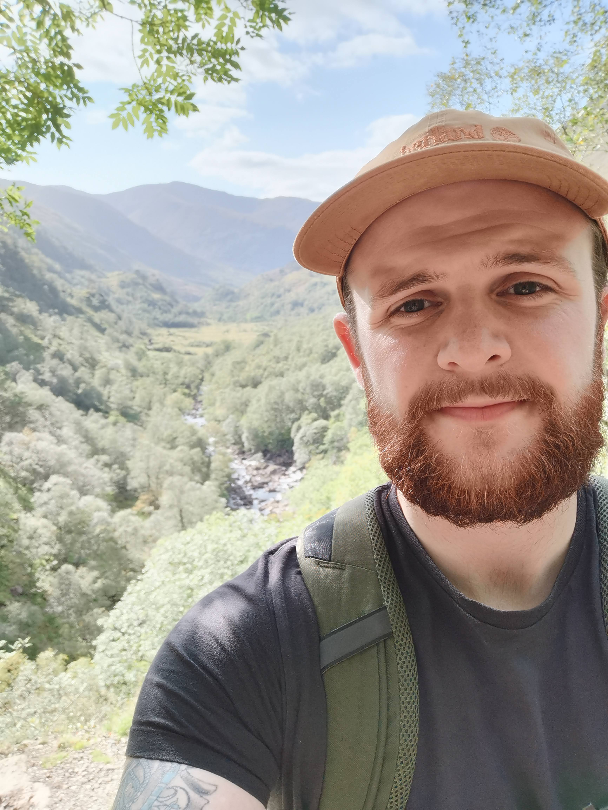

```{r setup, include=FALSE}
knitr::opts_chunk$set(echo = TRUE)
```


Welcome! I'm Declan McLaren, PhD Student at the University of Glasgow.

My research interests fall within the remit of neuropsychology, and include:

1. Stroke and Traumatic Brain Injury
1. Dementia
1. Behavioural Interventions for each, including mindfulness based interventions.

---

```{r, echo=FALSE, out.width="200px", fig.cap="Selfie at Glen Nevis"}
 
``` 


I am currently completing a SGSSS funded 1+3 PhD in the University of Glasgow's
[Institute of Neuroscience and Psychology](http://www.gla.ac.uk/researchinstitutes/neurosciencepsychology/).

I work within the Sleep and Mental Health lab, supervised by [Dr Maria Gardani](https://www.gla.ac.uk/schools/psychology/staff/mariagardani/), [Dr Satu Baylan](https://www.gla.ac.uk/researchinstitutes/healthwellbeing/staff/satubaylan/), and [Professor Jonathan Evans](https://www.gla.ac.uk/researchinstitutes/healthwellbeing/staff/jonathanevans/).
